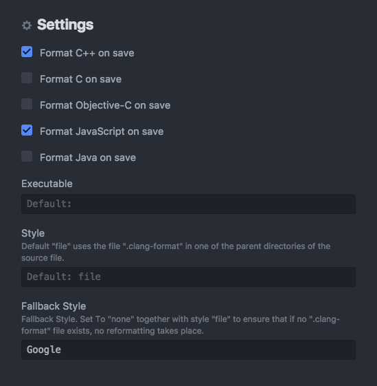

# Setting up your macOS system for coding at ECAL

## 1) Homebrew

Homebrew is a toolkit that lets you install tools and libraries from the console thanks to a community-driven repository.

```
/usr/bin/ruby -e "$(curl -fsSL https://raw.githubusercontent.com/Homebrew/install/master/install)"
```

**Optional:**
* `brew install cask`  Install mac software using brew!
* `brew cask install iterm2`  A better terminal.
* And much much more... `brew install ffmpeg imagemagick wget python3.5 ruby sqlite`...etc.


**Optional bis: Oh-my-zsh**

Great pre-configurations using zsh shell.
```
`sh -c "$(curl -fsSL https://raw.githubusercontent.com/robbyrussell/oh-my-zsh/master/tools/install.sh)"`
```

## 2) Node

Javascript for server code and system scripts:
`brew install node`

**Optional:**
* `npm install -g http-server` An easy to use web-server

## 3) Atom

Atom is a great open source coding tool that's mainly developed by Github.
It's free, has lots of features and is highly configurable, which makes it the
main coding tool at the M&ID Bachelor.

### Format Javascript automatically

```
brew install clang-format
apm install clang-format
```

Enable Google style guide and automatic format on save:
- Atom settings > clang-format settings > set  "Format on save"
- Atom settings > clang-format settings > set  "Fallback Style" to "Google"



### Show Javascript (ES6) syntax error inside Atom

```
npm install -g eslint eslint-config-google
apm install linter linter-ui-default linter-eslint
```

Atom settings > linter-eslint settings > enable "Use global ESLint installation"


⚠️ To enable eslint in your project, you must add file named '.eslintrc.json'
at the root if its folder structure:
```
{
  "extends": "google",
  "parserOptions": {
    "ecmaVersion": 6
  },
  "rules": {
    "require-jsdoc": "off",
    "no-unused-vars": "off"
  }
}
```

### Auto format python code

```
sudo -H pip install yapf
apm install python-yapf
```
Atom settings > python-yapf settings > check "Check on save" & "Format on save"


### "Nice to have" atom plugins

Shows icons in tree view depending on file type
```
apm install file-icons
```

And much much more...
```
apm install cssfmt prettify docblockr python-tools #...etc.
```
